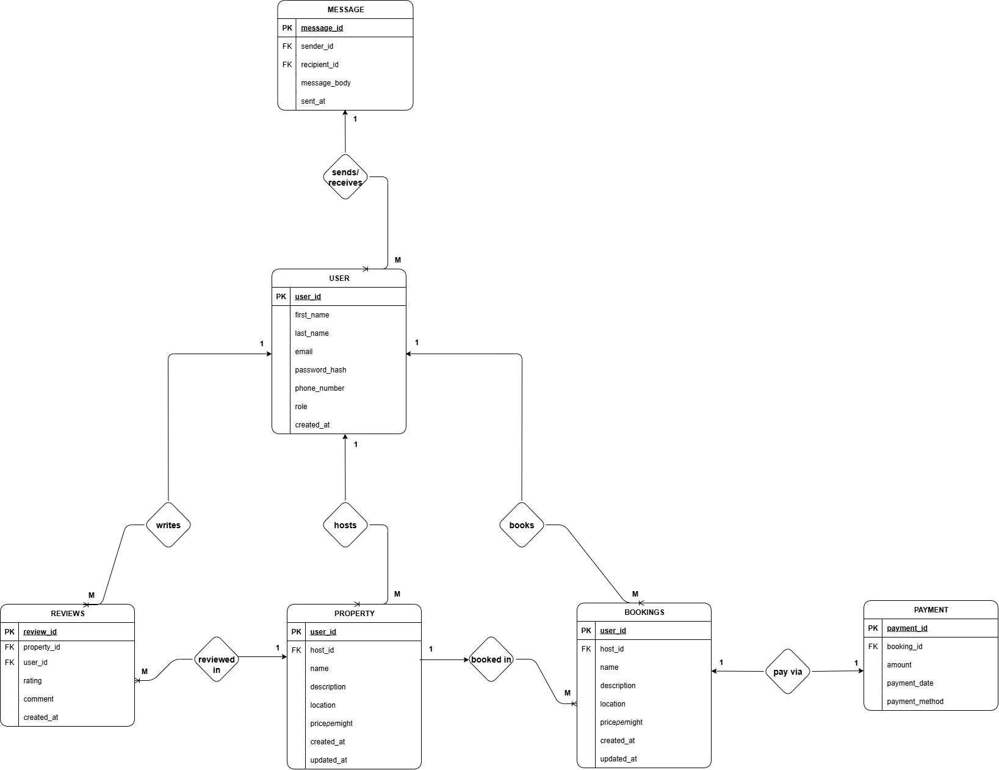

# 📘 Task 0: Entity-Relationship Diagram (ERD)

## 🧠 Objective
Design an Entity-Relationship Diagram (ERD) for an Airbnb-like application that models the core entities and their relationships. This diagram serves as the foundation for database normalization, schema creation, and data seeding in subsequent tasks.

---

## 🧩 Entities and Attributes

### 1. USER
- `user_id:` Primary Key, UUID, Indexed
- `first_name:` VARCHAR, NOT NULL
- `last_name:` VARCHAR, NOT NULL
- `email:` VARCHAR, UNIQUE, NOT NULL
- `password_hash:` VARCHAR, NOT NULL
- `phone_number:` VARCHAR, NULL
- `role:` ENUM (guest, host, admin), NOT NULL
- `created_at:` TIMESTAMP, DEFAULT CURRENT_TIMESTAMP

### 2. PROPERTY
- `property_id:` Primary Key, UUID, Indexed
- `host_id:` Foreign Key, references User(user_id)
- `name:` VARCHAR, NOT NULL
- `description:` TEXT, NOT NULL
- `location:` VARCHAR, NOT NULL
- `price_per_night:` DECIMAL, NOT NULL
- `created_at:` TIMESTAMP, DEFAULT CURRENT_TIMESTAMP
- `updated_at:` TIMESTAMP, ON UPDATE CURRENT_TIMESTAMP

### 3. REVIEWS
- `review_id:` Primary Key, UUID, Indexed
- `property_id:` Foreign Key, references Property(property_id)
- `user_id:` Foreign Key, references User(user_id)
- `rating:` INTEGER, CHECK: rating >= 1 AND rating <= 5, NOT NULL
- `comment:` TEXT, NOT NULL
- `created_at:` TIMESTAMP, DEFAULT CURRENT_TIMESTAMP

### 4. BOOKINGS
- `booking_id:` Primary Key, UUID, Indexed
- `property_id:` Foreign Key, references Property(property_id)
- `user_id:` Foreign Key, references User(user_id)
- `start_date:` DATE, NOT NULL
- `end_date:` DATE, NOT NULL
- `total_price:` DECIMAL, NOT NULL
- `status:` ENUM (pending, confirmed, canceled), NOT NULL
- `created_at:` TIMESTAMP, DEFAULT CURRENT_TIMESTAMP

### 5. PAYMENT
- `payment_id:` Primary Key, UUID, Indexed
- `booking_id:` Foreign Key, references Booking(booking_id)
- `amount:` DECIMAL, NOT NULL
- `payment_date:` TIMESTAMP, DEFAULT CURRENT_TIMESTAMP
- `payment_method:` ENUM (credit_card, paypal, stripe), NOT NULL

### 6. MESSAGE
- `message_id:` Primary Key, UUID, Indexed
- `sender_id:` Foreign Key, references User(user_id)
- `receiver_id:` Foreign Key, references User(user_id)
- `message_body:` TEXT, NOT NULL
- `sent_at:` TIMESTAMP, DEFAULT CURRENT_TIMESTAMP

---

## 🔗 Relationships

- A `USER` can:
  - Host multiple `PROPERTY` listings
  - Make multiple `BOOKINGS`
  - Write multiple `REVIEWS`
  - Send and receive `MESSAGE`s

- A `PROPERTY` can:
  - Be hosted by one `USER`
  - Receive multiple `REVIEWS`
  - Be booked in multiple `BOOKINGS`

- A `BOOKING`:
  - Is made by one `USER`
  - Is for one `PROPERTY`
  - Has one associated `PAYMENT`

- A `REVIEW`:
  - Is written by one `USER`
  - Is for one `PROPERTY`

- A `MESSAGE`:
  - Is sent/received from one `USER` to another

- A `PAYMENT`:
  - Is made for one `BOOKING`
---

## 🖼️ ERD Visualization

The ERD was created using Draw.io and visually represents the entities, attributes, and relationships described above.  
 
